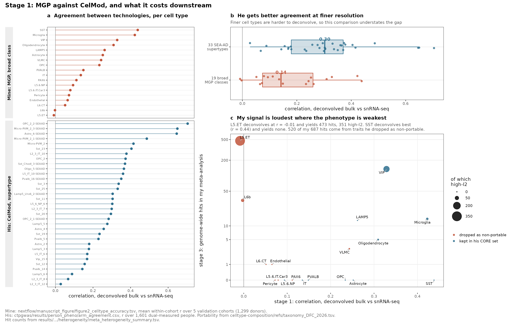
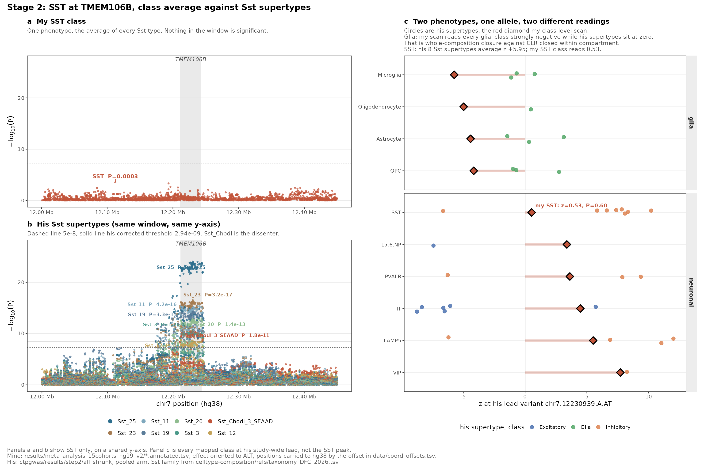
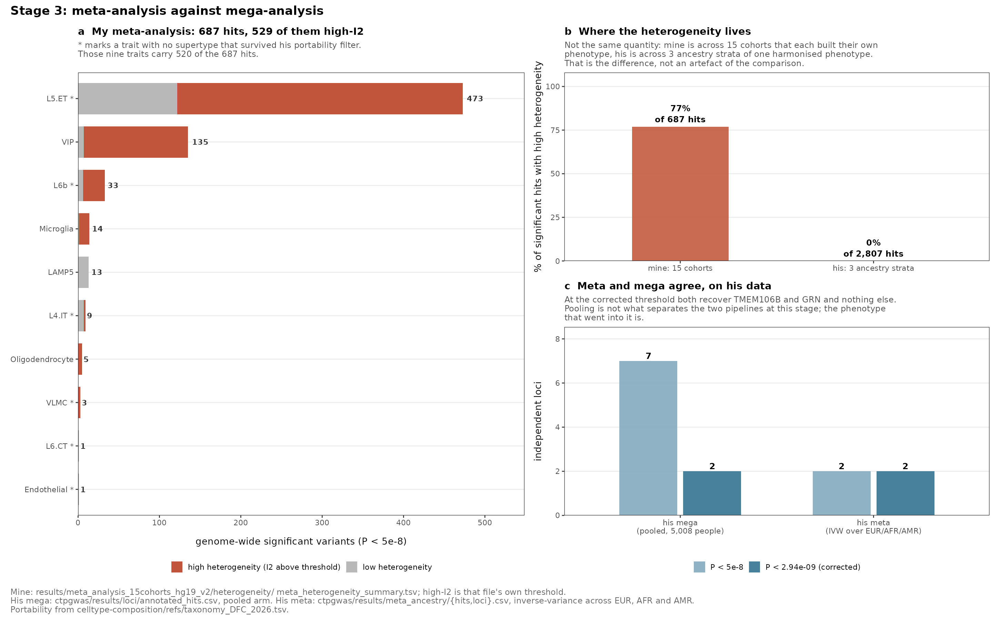
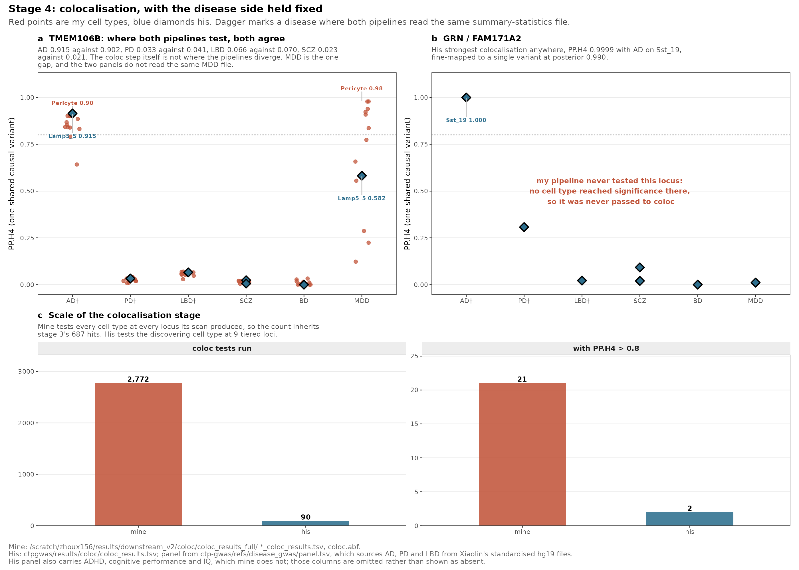
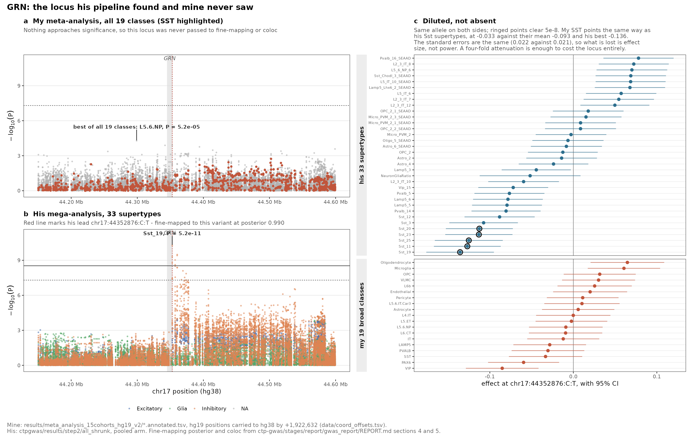

# Two cell-type-proportion GWAS pipelines, stage by stage

Comparison of the 15-cohort Nextflow meta-analysis against Shreejoy's phase-2
`ctp-gwas`, as of the 23 September 2026 pull (`celltype-composition` `bb58944`,
`ctp-gwas` `fe1d1ae`, `genotype-harmonization` `093afee`).

Every number below is read from one of the two result trees or recomputed by a
script in this directory. Where a figure and this document quote the same
number, the figure computes it and prints it, so the two cannot drift apart.
Where a number exists only in his written report it is marked `[REPORT.md]`.

---

## The short version

The two pipelines disagree about almost everything they output, and the
disagreement is created almost entirely in the first two stages. By the time
the summary statistics exist, the models behave the same way.

| stage | mine | his | is this where they diverge? |
|---|---|---|---|
| 1. Deconvolution | MGP, 19 broad classes, median bulk-vs-snRNA r **0.14** | CelMod, 33 supertypes, median r **0.30** | **yes** |
| 2. Phenotype and GWAS | proportions, residualise sex+age, RINT | within-compartment CLR, GLS, reliability shrinkage, RINT | **yes** |
| 3. Meta vs mega | METAL over 15 cohorts, **687 hits, 77% high-I2** | pooled mega, 33 pooled-arm hits, 2 loci corrected | no, see below |
| 4. Colocalisation | 2,772 tests, 21 at PP.H4 > 0.8 | 90 tests, 2 at PP.H4 > 0.8 | no |

The single most useful sentence: **at his GRN lead my SST effect is −0.033
against his −0.136, with the same standard error (0.022 against 0.021).** The
signal is present and pointing the right way. What my pipeline loses is effect
size, not sample size, and a four-fold attenuation is enough to cost the locus
entirely.

---

## Stage 1 — Deconvolution



**Design.** Mine uses marker-gene profiles (MGP) to estimate 19 broad classes.
His uses CelMod, trained to predict directly into centred-log-ratio space, for
33 SEA-AD supertypes drawn from a 152-supertype taxonomy.

**Result.** Both pipelines measured the same validation quantity: how well the
deconvolved bulk proportion tracks the directly counted snRNA-seq proportion in
donors who have both.

| | traits | median r | range |
|---|---|---|---|
| mine | 19 broad classes, 1,299 donors | **0.142** | −0.008 (`L5.ET`) to 0.438 (`SST`) |
| his | 33 supertypes, 1,601 donors | **0.303** | 0.028 (`L2_3_IT_12`) to 0.704 (`OPC_2_2`) |

He gets roughly twice the agreement at a **finer** resolution, which is the
harder task. The comparison is therefore conservative in his favour.

**Two numbers that should change how the incumbent results are read:**

- `L5.ET` deconvolves at **r = −0.008**, which is no signal at all, and goes on
  to produce **473 genome-wide hits, 351 of them high-heterogeneity** — 69% of
  my entire discovery set.
- `SST` deconvolves best, at **r = 0.438**, and produces **zero** hits.

**The portability filter says the same thing independently.** His CORE set keeps
only supertypes that transfer reliably across datasets. Of my 19 classes, **9
have no surviving supertype at all**: `Endothelial`, `L4.IT`, `L5.6.IT.Car3`,
`L5.ET`, `L6b`, `L6.CT`, `PAX6`, `Pericyte`, `VLMC`. `L5 ET` has 2 supertypes in
the taxonomy and **0** are core.

Those 9 traits carry **520 of my 687 genome-wide hits (76%)**.

Sources: `nextflow/manuscript_figure/figure2_celltype_accuracy.tsv`;
`ctpgwas/results/person_pheno/arm_agreement.csv`;
`celltype-composition/refs/taxonomy_DFC_2026.tsv`.

---

## Stage 2 — Phenotype construction and GWAS



**Design.** Mine takes proportions, regresses out sex and age, and applies a
rank-inverse-normal transform. His takes counts to centred log-ratio **closed
within compartment** (neurons and glia separately), combines a person's several
measurements by generalised least squares weighted by reliability, shrinks by
`sqrt(rho_composite)`, then applies RINT. Covariates were deliberately matched:
`build_regenie_inputs.py` says the age terms follow "Xiaolin's covariate set so
a comparison against her results cannot be attributed to the covariates."

**Result, at his strongest locus** (figure 3: panels a/b are SST only, on a
shared y-axis; panel c is every mapped class at his study-wide lead). At his
TMEM106B lead `chr7:12230939:A:AT`
(alleles identical on both sides; across this window 3,279 of my 3,844 variants
match his on position and alleles, none allele-swapped):

| my class | his supertypes | his mean z | my z | my P |
|---|---|---|---|---|
| **SST** | 8 (7 up, 1 down) | **+5.95** | **+0.53** | **0.60** |
| VIP | 1 | +8.24 | +7.71 | 1.2e-14 |
| LAMP5 | 4 | +5.93 | +5.51 | 3.5e-08 |
| PVALB | 3 | +3.66 | +3.62 | 3.0e-04 |
| IT | 6 | −5.09 | **+4.47** | 7.6e-06 |
| L5.6.NP | 1 | −7.41 | **+3.38** | 7.0e-04 |
| Astrocyte | 3 | +0.67 | **−4.41** | 1.0e-05 |
| Microglia | 3 | −0.34 | **−5.74** | 9.5e-09 |
| OPC | 3 | +0.35 | **−4.15** | 3.3e-05 |
| Oligodendrocyte | 1 | +0.47 | **−4.97** | 7.0e-07 |

Three things are happening at once, and they are separable.

1. **Where his supertypes agree with each other, my class scan reproduces
   them.** `VIP`, `LAMP5` and `PVALB` match closely in both sign and magnitude.
   The pipelines are not simply incomparable.

2. **Every glial class in my scan reads strongly negative while his glial
   supertypes sit at zero.** This is the clearest single consequence of a design
   choice in the whole comparison. My proportions are closed across all cell
   types, so an allele that raises neurons must lower glia arithmetically. His
   CLR is closed **within compartment**, so a neuronal shift cannot push glia at
   all. My four glial signals at this locus (−4.15 to −5.74, one of them
   genome-wide significant) are compositional shadows of the neuronal effect,
   not independent glial findings.

3. **`SST` is the failure case.** His 8 Sst supertypes average z +5.95 and reach
   P 9.4e-25. My `SST` class reads z +0.53, P 0.60. Note this is *not* simple
   cancellation between opposing supertypes — 7 of his 8 move the same way. The
   MGP `SST` phenotype is measuring something that does not carry the signal,
   which is consistent with stage 1 even though `SST` is my best-deconvolved
   class.

Sources: `results/meta_analysis_15cohorts_hg19_v2/*.annotated.tsv` (using
`BETA_ALT`, so effect signs align with his REGENIE `ALLELE1`);
`ctpgwas/results/step2/all_shrunk`. Positions carried to hg38 by the offsets in
`data/coord_offsets.tsv`. `[REPORT.md]` for the 13-versus-3 inhibitory split and
the corrected threshold 2.94e-09.

---

## Stage 3 — Meta-analysis against mega-analysis



**Design.** Mine runs REGENIE per cohort and combines with METAL inverse-variance
meta-analysis over 15 cohorts and 3,620 samples, which yields an I2 per variant.
His pools 5,008 people into one mega-analysis with cohort as a covariate, which
yields no I2 at all.

**Result.** 687 genome-wide-significant variant-by-trait results on my side,
**529 of them (77%) high-heterogeneity**, concentrated in exactly the traits
stage 1 flagged: `L5.ET` 473 hits with 351 high-I2, `VIP` 135 with 128, `L6b` 33
with 27, `Microglia` 14 with 13. His pooled arm gives 33 hits over 7 loci at
5e-8, of which 2 clear his corrected threshold.

**This is the stage where the obvious inference is wrong.** It is tempting to
read 687 against 33 as a verdict on meta versus mega. It is not, and the control
that shows why is his: he also ran a plain inverse-variance meta across his three
ancestry strata, on the same people and the same variants
(`meta_ancestry/hits.csv`). If pooling were doing the work, that meta would look
like mine. Instead:

- it recovers **2 loci**, TMEM106B at 3.06e-32 and GRN at 2.80e-11, the same two
  its mega found;
- **0 of its 2,807 hits** are variants the pooled scan did not test;
- its I2 is **median 0.0, mean 0.2, with 0% above 50**.

Meta and mega give the same answer on his data. What separates the two pipelines
at this stage is the phenotype that went into them, not how the cohorts were
combined. My 77% high-heterogeneity is not evidence that meta-analysis is the
wrong model — it is evidence that 15 cohorts each built their phenotype
differently.

One caveat stated plainly: my I2 is across 15 cohorts with independent phenotype
pipelines, his is across 3 ancestry strata of one harmonised phenotype. These
are not the same quantity. That difference *is* the finding rather than a flaw
in the comparison, but it should not be quoted as though the two I2 columns were
interchangeable.

Sources: `results/meta_analysis_15cohorts_hg19_v2/heterogeneity/meta_heterogeneity_summary.tsv`
(high-I2 uses that file's own threshold); `ctpgwas/results/loci/annotated_hits.csv`;
`ctpgwas/results/meta_ancestry/{hits,loci}.csv`.

---

## Stage 4 — Colocalisation with disease



**Design.** Nearly a controlled experiment. His
`ctp-gwas/refs/disease_gwas/panel.tsv` sources `AD_Bellenguez2022`,
`PD_Nalls2019` and `LBD_Chia2021` from
`/scratch/zhoux156/results/downstream_v2/disease_gwas_hg19/`, annotated
"Xiaolin's standardised hg19". For those three the disease side is literally the
same files, so any difference in the posterior comes from the cell-type side
alone.

The two designs differ in shape: mine tests every cell type whose scan produced
a locus, 12 of them at TMEM106B; his tests the one cell type that discovered
each locus.

**Result at TMEM106B — the two pipelines agree.**

| disease | his (`Lamp5_5`) | mine (best of 12 classes) |
|---|---|---|
| AD | 0.915 | 0.902 (`Pericyte`) |
| PD | 0.033 | 0.041 (`VLMC`) |
| LBD | 0.066 | 0.070 (`LAMP5`) |
| SCZ | 0.023 | 0.021 (`PVALB`) |
| BD | 0.000 | 0.033 (`IT`) |
| MDD | 0.582 | 0.979 (`Pericyte`) |

On the three diseases where both read the same file, the posteriors are
essentially identical. **The colocalisation step is not where the pipelines
diverge.** MDD is the one gap and the two panels do not read the same MDD file
(`MDD_MDD2025` against `MDD_2025_Clin`), so it should not be treated as a
discrepancy without checking.

**Result at GRN — the locus is missing from my pipeline entirely**, not because
coloc disagreed but because stage 2 never produced a significant hit there, so
it was never passed to coloc. His GRN colocalises with AD at **PP.H4 0.9999**,
his strongest posterior anywhere, using my own AD summary statistics.

Sources: `/scratch/zhoux156/results/downstream_v2/coloc/coloc_results_full/*_coloc_results.tsv`;
`ctpgwas/results/coloc/coloc_results.tsv`; `ctp-gwas/refs/disease_gwas/panel.tsv`.

---

## The GRN locus, in detail



GRN is the cleanest case in the comparison, and the most useful diagnostic,
because it separates "my pipeline is blind here" from "my pipeline is quieter
here".

At his lead `chr17:44352876:C:T`, my best across all 19 classes anywhere in the
window is `L5.6.NP` at P 5.2e-05. Nothing is significant. But the effect
estimates are not null:

| | effect | SE | P |
|---|---|---|---|
| his `Sst_19` (lead) | **−0.136** | 0.021 | 5.17e-11 |
| his 8 Sst supertypes, mean | −0.093 | ~0.021 | — |
| **my `SST`** | **−0.033** | **0.022** | 0.137 |
| my `VIP` | −0.085 | 0.022 | 1.2e-04 |

My `SST` points the same way with **a quarter the magnitude and the same
standard error**. Precision is not the problem; the phenotype is. This is what
attenuation by measurement error looks like, and it ties stage 4's missing locus
back to stage 1's r = 0.44.

For context on what the locus is worth: his GRN fine-maps to this single variant
at posterior **0.990** with only 3 LD partners above r2 0.6, whereas TMEM106B —
twenty-two orders of magnitude stronger — does not resolve at all, its smallest
credible set holding 51 variants over 124 correlated partners. `[REPORT.md]`
section 4.

---

## What this does and does not establish

**Established here, from data:**

- The deconvolution gap at stage 1, and that my loudest trait is my worst-measured one.
- That whole-composition closure manufactures glial signals that within-compartment CLR does not.
- That meta versus mega is not the driver, because his own meta agrees with his mega.
- That the coloc step agrees where both pipelines test the same locus with the same disease file.
- That GRN is attenuated rather than absent in my data.

**Not established here:**

- My genomic-control lambda. His is median 1.0026 with 0 of 101 traits outside
  [0.95, 1.05] `[REPORT.md]`. Mine has not been computed; it needs one pass over
  ~18 GB and so a short Slurm job. This is the most important remaining gap,
  because 687 hits at 77% heterogeneity invites the question of calibration and
  nothing here answers it.
- Genome-wide concordance between the two sets of summary statistics. Everything
  above is at two loci.
- Whether my `L5.ET` hits are false positives. They are unreliable at stage 1 and
  heterogeneous at stage 3, which is suggestive, but neither is a formal test.
- Anything about chrX, which is absent from both, or chr8, which his report flags
  at ~71% retention `[REPORT.md]` section 9.

---

## Reproducing this

```bash
cd /project/rrg-shreejoy/zhoux156/external-Xiaolin/compare_shreejoy_with_nextflow
bash   01_extract_my_loci.sh        # ~5 min, 25 GB sequential read
python 02_extract_his_loci.py       # ~1 min
python 03_build_trait_map.py
python 04_align_coords.py           # derives the hg19->hg38 offsets
python 05_collect_stage_tables.py
for f in fig*.R; do /home/zhoux156/miniforge3/envs/test/bin/Rscript "$f"; done
```

All steps are read-only against both result trees. Nothing is written outside
this directory.

**On coordinates.** No liftover chain file or `pyliftover` exists on this system
and installing one needs approval, so `04_align_coords.py` derives the offset
from the data: it matches variants on REF/ALT with concordant frequency and
takes the modal offset, then requires it to beat the runner-up by 50x and to
land within 2 kb of the gene-annotation offset. Both windows pass comfortably —
chr7 at −39,626 (3,035 supporting variants, 506x the runner-up, **1 bp** from
the annotation) and chr17 at +1,922,632 (1,060 variants, 353x, 37 bp). Evidence
is in `data/coord_offsets.tsv`.
